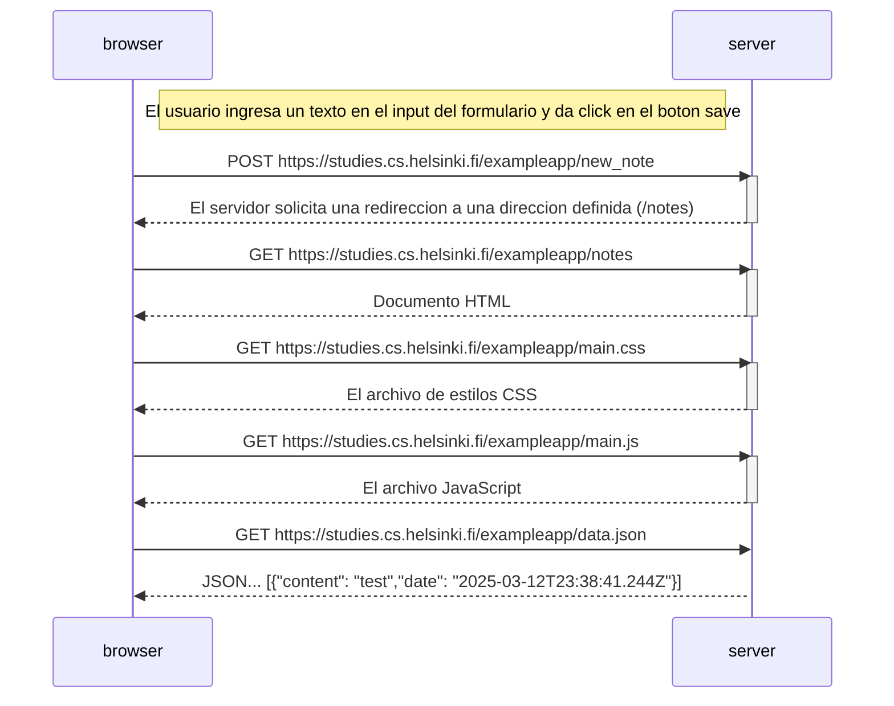

Tarea 0.6

```mermaid
sequenceDiagram
    participant browser
    participant server

    Note right of browser: El usuario ingresa un texto en el input del formulario y da click en el boton save 

    browser->>server: POST https://studies.cs.helsinki.fi/exampleapp/new_note
    activate server
    server-->>browser: El servidor solicita una redireccion a una direccion definida (/notes)
    deactivate server

    browser->>server: GET https://studies.cs.helsinki.fi/exampleapp/notes
    activate server
    server-->>browser: Documento HTML
    deactivate server

    browser->>server: GET https://studies.cs.helsinki.fi/exampleapp/main.css
    activate server
    server-->>browser: El archivo de estilos CSS
    deactivate server

    browser->>server: GET https://studies.cs.helsinki.fi/exampleapp/main.js
    activate server
    server-->>browser: El archivo JavaScript
    deactivate server

    browser->>server: GET https://studies.cs.helsinki.fi/exampleapp/data.json
    activate server
    server-->>browser: JSON... [{"content": "test","date": "2025-03-12T23:38:41.244Z"}]

```